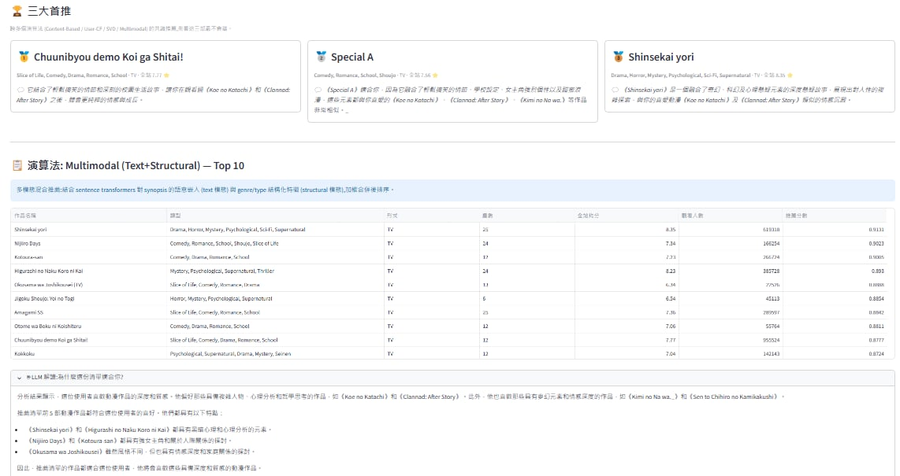
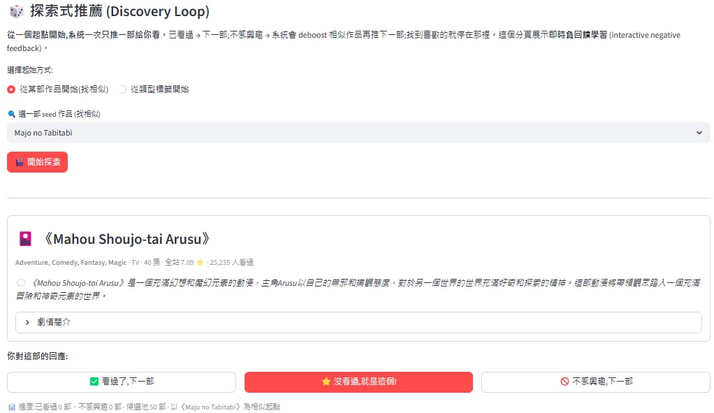

# Anime Recommender System

A hybrid anime recommendation system combining classical collaborative-filtering methods with multimodal text embeddings and LLM-augmented natural-language explanations. Built as a Streamlit web demo on a training-serving separation architecture.

Five recommendation algorithms (Popularity baseline, Content-Based, User-CF, SVD, Multimodal) plus two interactive features: ensemble-based Top Picks via Reciprocal Rank Fusion, and a Tinder-style discovery loop with on-the-fly negative feedback. Each recommendation is supplemented by a natural-language pitch generated by Groq-hosted Llama 3.1.

---

## Screenshots

<!-- Drop screenshots into a `docs/` folder (e.g. `docs/screenshot-top-picks.png`) and reference them here. -->

| | |
|---|---|
|  |  |
| Cross-model Top Picks with LLM-generated pitches | Tinder-style discovery loop with deboost feedback |

---

## Highlights

- **Multimodal hybrid recommender** — combines `sentence-transformers` 384-D synopsis embeddings with structural (genre + type) features at a 0.6 / 0.4 weighting.
- **LLM-augmented explanations** — three prompt templates served by Groq Llama 3.1 8B Instant for per-card pitches and overall taste analysis. Responses cached via `@st.cache_data` to amortize cost and latency.
- **Cross-model Top Picks** — Reciprocal Rank Fusion across four algorithms produces a high-confidence top-3 with cross-model consensus as the primary ranking key.
- **Interactive discovery loop** — single-card browsing with three actions (seen / pick / not-interested). Rejections accumulate a centroid in embedding space and deboost similar remaining candidates: a one-shot online learning loop from negative feedback.
- **Robust cold-start** — SVD fold-in via ridge-regularized least squares, on-the-fly cosine for User-CF, rating-weighted similarity for Content-Based and Multimodal.
- **Production-grade ergonomics** — five-tab Streamlit UI, family-safe content filter with automatic popularity-padding fallback, graceful degradation when LLM is unavailable.

---

## Architecture

Heavy work (model training, embedding generation, offline evaluation) runs on Google Colab; the local serving layer runs on a plain Python environment without GPU dependencies.

| Layer | Responsibility | Stack |
|---|---|---|
| Training | Data preprocessing, model fitting, embedding generation, offline evaluation | Colab CPU, `scikit-learn`, `scipy.sparse.linalg.svds`, `sentence-transformers` |
| Serving | Inference, UI, LLM orchestration | Local Python 3.10+, `streamlit`, `numpy`, `scipy`, `pandas`, `groq` |

Trained artifacts (`.pkl`, `.npz`, `.npy`, `.parquet`) flow from Colab → Google Drive → local `artifacts/`. The serving code never re-trains; cold start is ~3 seconds.

---

## Project Structure

```
anime-recsys/
├── app.py                              # Streamlit entry point (6 tabs)
├── requirements.txt
├── .streamlit/
│   └── secrets.toml.example            # Template for Groq API key
├── src/
│   ├── recommender.py                  # 5 algorithms + Discovery + ColdStart + Ensemble RRF
│   └── llm.py                          # Groq client + 3 prompt templates
├── notebooks/                          # All training is run here in Colab
│   ├── 01_eda.ipynb                    # Dataset download, EDA, train/test split
│   ├── 02_train_models.ipynb           # Content-Based, User-CF, SVD
│   ├── 03_evaluate.ipynb               # Precision@10, Recall@10, NDCG@10
│   └── 04_multimodal_embeddings.ipynb  # sentence-transformers text embeddings
└── artifacts/                          # Trained outputs (gitignored, fetched from Drive)
```

---

## Quick Start

### Prerequisites
- Python 3.10 or newer
- A [Groq API key](https://console.groq.com) (free tier is sufficient)

### Install
```bash
git clone https://github.com/Virousttyu/anime-recsys.git
cd anime-recsys

# Optional but recommended
python -m venv .venv
.venv\Scripts\activate         # Windows
# source .venv/bin/activate    # macOS / Linux

pip install -r requirements.txt
```

### Configure the LLM
Copy the template and fill in your Groq API key:
```bash
# Windows
copy .streamlit\secrets.toml.example .streamlit\secrets.toml
# macOS / Linux
# cp .streamlit/secrets.toml.example .streamlit/secrets.toml
```
Edit `.streamlit/secrets.toml` and set `api_key = "gsk_..."`. The file is gitignored — never commit your key.

### Get the trained artifacts
Model files are too large for git (the `text_embeddings.npy` alone is 20 MB). Two options:

**A. Download pre-trained artifacts (recommended)**
[Google Drive folder](https://drive.google.com/drive/folders/1Toe0bj6tEPwrx8V-HVid48t-nk9Zmw6_?usp=sharing). Download the entire folder and place its contents into `artifacts/`.

**B. Train from scratch**
Run the four notebooks in `notebooks/` in Google Colab in order (01 → 02 → 03 → 04). Artifacts land in `MyDrive/anime-recsys/artifacts/`; copy them to local `artifacts/`.

### Launch
```bash
streamlit run app.py
```
Open `http://localhost:8501`.

---

## Dataset

[Anime Recommendation Database 2020](https://www.kaggle.com/datasets/hernan4444/anime-recommendation-database-2020) by hernan4444. After preprocessing — removing implicit-feedback rows, two-pass filtering of users/items with fewer than 5 interactions, and a random 50K-user sample for tractability — the working dataset contains ~13,740 anime, 50K users, and roughly 2.8M ratings. 83% of items have a meaningful synopsis suitable for text embedding.

Train / test split is per-user 80/20 with a fixed seed. Ground truth for evaluation is the set of held-out items rated ≥ 8 by each user.

---

## Methodology

### Multimodal Hybrid Recommender
For a user with seen-item index set Iᵤ:

1. **Text preference vector**  `tᵤ = normalize(mean(E_text[i] for i in Iᵤ))`
2. **Text similarity**  `s_text(j) = tᵤ · E_text[j]` (cosine, since embeddings are L2-normalized)
3. **Structural similarity**  `s_struct(j) = Σ_{i in Iᵤ} W_struct[i, j]` (precomputed sparse top-50 cosine matrix over genre + type)
4. **Combined score**  `s(j) = 0.6 · min_max(s_text) + 0.4 · min_max(s_struct)`

Min-max normalization brings the two similarity distributions onto the same scale before weighted combination. The text weight is intentionally larger because the structural feature space (~52 dimensions) has limited discriminative power.

### Ensemble Top Picks via Reciprocal Rank Fusion
For each algorithm A in {Content-Based, User-CF, SVD, Multimodal} (Popularity excluded to avoid mainstream bias), take the top-30 recommendations Lₐ. For every item i appearing in any list:

```
RRF_score(i) = Σ over A with i ∈ Lₐ: 1 / (rank_A(i) + 1)
```

The final 3 items are ranked first by **number of models that endorsed them** (primary key), then by RRF score (tiebreaker). RRF is robust to absolute-score disagreements between algorithms — see [Cormack et al., 2009].

### Discovery Loop with On-the-fly Deboost
Two entry points: pick a seed anime (system retrieves the 50 most similar by combined multimodal score) or multi-select genre tags (system ranks by match count and member count). The user sees one card at a time with three buttons:

- **Seen** — move to next candidate.
- **This one** — terminate with selected item.
- **Not interested** — add to rejected set and recompute the next card.

On rejection, the system maintains a rejected centroid in the text embedding space:

```
r_centroid = normalize(mean(E_text[r] for r in rejected))
adjusted_score(c) = base_score(c) − 0.4 · (E_text[c] · r_centroid)
```

The next card is `argmax adjusted_score`. This is effectively a single-session online learning loop driven entirely by explicit negative feedback.

### LLM Integration
[Groq](https://console.groq.com) serves Llama 3.1 8B Instant with first-token latency around 30-50 ms. Three prompt templates:

| Prompt | Use | Length |
|---|---|---|
| `top_pick_pitch` | One-line pitch under each top-pick card | ~40 chars |
| `top10_explanation` | Paragraph analysis of taste alignment with the Top-10 list | ~100-150 chars |
| `discovery_pitch` | One-line pitch for each discovery-loop card | ~60 chars |

The LLM is **not** used as a ranker — it generates post-hoc explanation only. The reasoning: per-item LLM inference at the 17K-item scale is too costly, and offline-evaluable ranking is preferable to a black-box LLM ranker. Failure modes (rate limits, network issues) fall back silently to empty strings without breaking the UI.

### Cold-Start Support
The "Custom user" tab lets a brand-new user rate 5-10 anime and get instant recommendations:
- **Content-Based / Multimodal**: weighted similarity with centered weights `w = (rating − 5) / 5` to support negative preferences.
- **User-CF**: on-the-fly cosine of the new user's rating vector against all existing users, take 30 nearest neighbors.
- **SVD fold-in**: ridge-regularized least squares to solve for a temporary user latent vector — `(VᵀV + λI) u = Vᵀ (r − μ − b)` with `λ = 0.1`.

---

## Results

Offline evaluation on 1000 randomly sampled users (k = 10):

| Algorithm | Precision@10 | Recall@10 | NDCG@10 |
|---|---|---|---|
| Popularity (baseline) | 0.1395 | 0.0840 | 0.1704 |
| Content-Based | 0.0314 | 0.0234 | 0.0399 |
| **User-Based CF** | **0.2966** | **0.1992** | **0.3589** |
| SVD | 0.0619 | 0.0351 | 0.0764 |
| Multimodal (Text + Structural) | (see `notebooks/03_evaluate.ipynb`) | | |

User-CF dominates the classical baselines at 2.1× over Popularity, reflecting strong taste clustering in the anime fandom. Content-Based and SVD underperform Popularity for reasons discussed in the development notes — the structural feature space is low-dimensional and `scipy.sparse.linalg.svds` zero-imputes unobserved entries, biasing predictions toward low values.

---

## Tech Stack

`Python 3.10` · `Streamlit` · `NumPy` · `SciPy` · `scikit-learn` · `pandas` · `sentence-transformers` (training only) · `Groq` SDK · Google Colab · MyAnimeList dataset

---

## Notes

- Training and serving environments are intentionally decoupled. Adding a new model class only requires updating `src/recommender.py` and re-running the relevant notebook — the serving layer auto-detects available artifacts at startup.
- The family-safe filter uses keyword matching against the genre string and is a known simplification; a content-safety classifier would be a stronger replacement.
- Future directions: CLIP-based cover-image embeddings (true tri-modal), surprise-style SGD-SVD for a fair MF comparison, LLM-based small-scale re-ranking ablation.
